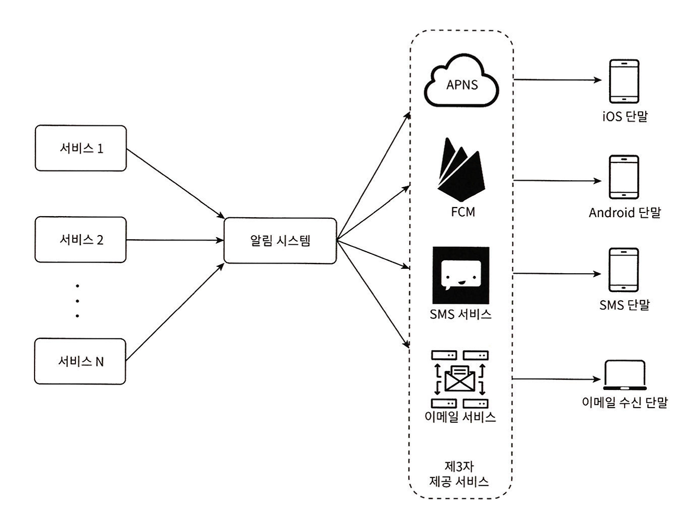
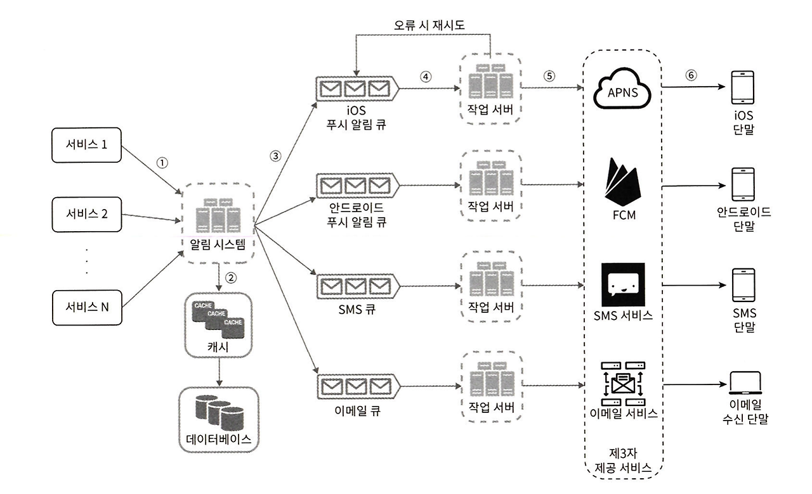
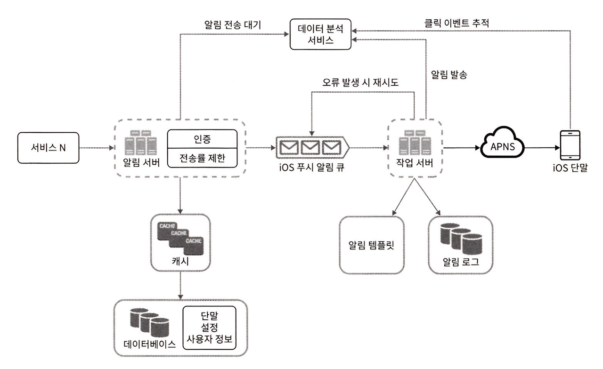

## 1. Notification System

- 알림 시스템은 사용자에게 중요할 만한 정보를 비동기적으로 전달하는 시스템입니다.
- 알림 시스템은 단순히 모바일 푸시 알림에 한정되지 않습니다.
	- 모바일 푸시 알림, SMS, 이메일 등 다양한 방식으로 알림을 전달할 수 있습니다.
- 이번 글에서는 iOS 푸시 알림, 안드로이드 푸시 알림, SMS, email을 지원하는 알림 시스템을 설계해보겠습니다.

## 2. 알림 유형

- 먼저 알림 유형별로 알림 메커니즘이 어떻게 동작하는지 알아보겠습니다.

### 2.1 iOS 푸시 알림

- iOS 푸시 알림을 보내기위해서는 세 가지 컴포넌트가 필요합니다.
- Provider
	- 알림 요청을 만들어 APNS에 전달하는 주체입니다.
	- 알림을 만들기 위해서는 device token과 payload가 필요합니다.
	- device token은 device를 식별하는 고유한 값입니다.
	- payload는 알림 내용을 담고 있는 데이터입니다.
- APNS
	- 애플이 제공하는 원격 서비스입니다.
	- iOS 장치로 알림을 보내는 역할을 담당합니다.
- Device
	- 푸시 알림을 수신하는 사용자 단말입니다.

### 2.2 안드로이드 푸시 알림

- 안드로이드 푸시 알림을 보내기위해서는 세 가지 컴포넌트가 필요합니다.
- iOS와 비슷한 절차로 동작합니다. APNS 대신 FCM(Firebase Cloud Messaging)을 사용합니다.
- Provider
	- 알림 요청을 만들어 FCM에 전달하는 주체입니다.
	- 알림을 만들기 위해서는 device token과 payload가 필요합니다.
- FCM(Firebase Cloud Messaging)
	- 구글이 제공하는 원격 서비스입니다.
	- 안드로이드 장치로 알림을 보내는 역할을 담당합니다.
- Device
	- 푸시 알림을 수신하는 사용자 단말입니다.

### 2.3 SMS

- SMS는 문자 메시지를 통해 알림을 전달합니다.
- SMS를 보내기 위해서는 세 가지 컴포넌트가 필요합니다.
- Provider
	- SMS를 보내는 주체입니다.
	- SMS를 보내기 위해서는 phone number와 message가 필요합니다.
- SMS 서비스
	- SMS를 보내는 서비스입니다.
	- 보통 트윌리오, 넥스모 같은 제3자 서비스를 사용합니다.
- Device
	- 푸시 알림을 수신하는 사용자 단말입니다.

### 2.4 Email

- Email은 이메일을 통해 알림을 전달합니다.
- Email을 보내기 위해서는 세 가지 컴포넌트가 필요합니다.
- Provider
	- Email을 보내는 주체입니다.
	- Email을 보내기 위해서는 email address와 message가 필요합니다.
- Email 서비스
	- Email을 보내는 서비스입니다.
	- 대부분의 회사는 고유 이메일 서버를 구축해 사용합니다.
	- 그럼에도 많은 회사가 사용 이메일 서비스를 사용하기도 합니다.
	- 센드그리드, 메일침프 등의 제3자 서비스를 사용할 수 있습니다.
- Device
	- 푸시 알림을 수신하는 사용자 단말입니다.

## 3. 연락처 정보 수집

- 알림 시스템을 설계할 때 연락처 정보 수집은 필수적입니다.
- 푸시 알림을 보내기 위해서는 모바일 단말 토큰, 전화번호, 이메일 주소 등의 정보가 수집되어야 합니다.
- 사용자가 앱을 설치하거나 처음 계정으로 등록하면 연락처 정보를 수집하여 데이터베이스에 저장합니다.

### 3.1 간단한 테이블 설계

- 아래 테이블 구조는 필수 정보만 담은 개략적인 설계입니다.
- 한 사용자가 여러 단말을 가질 수 있도록 설계되어 있습니다.
	- user와 device는 1:N 관계입니다.
- user 테이블
	- user_id
	- email
	- phone_number
- device 테이블
	- id
	- device_token
	- user_id
	- last_login_at

## 4. 설계안 1

- 설계안 1은 아래와 같은 컴포넌트로 구성됩니다.
	- 서비스: 서비스는 각각 마이크로서비스일 수도 있고, 크론잡일 수도 있습니다. 예를 들어 배송 알림을 보내려는 쇼핑몰 웹사이트라고 볼 수 있습니다.
	- 알림 시스템: 알림 시스템은 알림을 보내는 시스템입니다. 서비스에 알림 전송을 위한 API를 제공합니다.
	- 제3자 서비스: 이 서비스들이 사용자에게 알림을 실제로 전달합니다.
	- 단말: 사용자는 자기 단말에서 푸시 알림을 받습니다.

### 4.1 문제점: SPOF

- 현재 설계안은 하나의 알림 서비스에 서버가 하나 밖에 없는 상황입니다.
- 해당 서버에 장애가 발생하면 전체 서비스 장애로 이어집니다. 이를 SPOF(Single Point of Failure)라고 합니다.

### 4.2 문제점: 규모 확장성

- 한 대 서비스로 모든 알림을 보내므로 서버 부하가 높아집니다.
- 데이터베이스나 캐시 등 중요 컴포넌트의 규모를 개별적으로 늘릴 방법이 없습니다.

## 5. 설계안 2

- 설계안 1의 문제점을 해결하기 위해 아래와 같은 설계안을 제시합니다.
- 데이터베이스와 캐시를 알림 시스템의 주 서버에서 분리합니다.
- 알림 서버를 stateless 서비스로 설계하여 수평적 확장이 가능하도록 합니다.
- 메시지 큐를 사용하여 시스템 컴포넌트 사이의 결합도를 낮춥니다.

### 5.1 컴포넌트 구조

- 서비스
- 알림 서버
	- 스팸 방지를 위해 보통 사내 서비스 또는 인증된 클라이언트만 접근 가능합니다.
	- 알림 검증: 이메일 주소, 전화번호 등에 대한 기본적인 검증을 합니다.
	- 데이터베이스 또는 캐시 질의: 알림에 포함시킬 데이터를 질의합니다.
	- 알림 전송: 알림 데이터를 메시지 큐에 넣습니다.
- 캐시
	- 사용자 정보, 단말 정보, 알림 템플릿 등을 캐시합니다.
- 데이터베이스
	- 사용자, 알림, 설정 등 다양한 정보를 저장합니다.
- 메시지 큐
	- 알림의 종류별로 별도 메시지 큐를 사용합니다.
	- 시스템 컴포넌트간 결합도를 낮춥니다.
	- 다량의 알림이 발송되는 경우를 대비한 버퍼 역할을 합니다.
- 작업 서버
	- 메시지 큐에서 전송할 알림을 꺼내서 제3자 서비스에 전달합니다.
- 제3자 서비스
	- 알림을 전달하는 서비스입니다.
	- 알림의 종류별로 별도 제3자 서비스를 사용합니다.
- 단말
	- 알림을 수신하는 사용자 단말입니다.

### 5.2 알림 전송 흐름

1. API를 호출하여 알림 서버로 알림 요청을 보냅니다.
2. 알림 서버는 사용자 정보, 단말 토큰, 알림 설정 같은 메타데이터를 캐시나 데이터베이스에서 질의합니다.
3. 알림 서버는 전송할 알림에 맞는 이벤트를 만들어서 메시지 큐에 넣습니다. (가령 iOS 푸시 이벤트는 iOS 푸시 알림 큐에 넣습니다.)
4. 작업 서버는 메시지 큐에서 이벤트를 꺼냅니다.
5. 작업 서버는 알림을 제3자 서비스로 전달합니다.
6. 제3자 서비스는 알림을 단말로 전달합니다.

## 6. 안정성

- 분산 환경에서 안정성 확보를 위해 몇 가지 사항을 고려해야 합니다.

### 6.1 데이터 손실 방지

- 알림 전송 과정에서 데이터 손실이 발생하지 않도록 해야 합니다.
- 이 요구사항을 만족하려면 알림 시스템은 알림 데이터를 데이터베이스에 보관하고 재시도 메커니즘을 구현해야 합니다.
- 알림 로그 데이터베이스를 유지하는 것이 한 가지 방법입니다.

### 6.2 알림 중복 전송 방지

- 알림 전송 과정에서 중복 전송이 발생하지 않도록 해야 합니다.
- 작업 서버에서 보내야할 알림이 도착하면 이벤트 ID를 검사하여 이전에 본 적이 있는지 확인합니다.
- 이벤트 ID가 이미 처리된 경우 중복 전송을 방지하기 위해 처리하지 않습니다.

## 7. 추가 고려사항

### 7.1 알림 템플릿

- 알림 메시지의 대부분은 형식이 동일합니다.
- 템플릿을 사용하면 알림의 형식을 일관성 있게 유지할 수 있습니다.

### 7.2 알림 설정

- 사용자가 알림 설정을 변경할 수 있습니다.
- 알림 설정 정보는 데이터베이스에 저장됩니다.
- 알림 설정이 도입되면 알림을 보내기 전에 반드시 사용자가 해당 알림을 켜 두었는지 확인해야 합니다.

### 7.3 전송률 제한

- 한 사용자가 받을 수 있는 알림의 빈도를 제한해야 합니다.
- 알림이 너무 많으면 사용자가 알림 기능을 끄게 될 수 있습니다.

### 7.4 재시도 방법

- 제3자 서비스가 알림 전송을 실패하면, 해당 알림을 재시도 전융 큐에 넣습니다.
- 같은 문제가 반복되면 개발자에게 통지하도록 할 수 있습니다.

### 7.5 큐 모니터링

- 알림 시스템의 중요 메트릭 중 하나로 큐의 메시지 수를 모니터링할 수 있습니다.
- 큐의 메시지 수가 너무 많으면 이벤트를 빠르게 처리하고 있지 못하다는 것을 의미합니다.
- 이런 경우 작업 서버를 늘려서 이벤트를 빠르게 처리할 수 있도록 해야 합니다.

## 8. 최종 설계안

### 8.1 컴포넌트 구조

- 서비스
- 알림 서버
	- 인증과 전솔융 제한 기능을 추가합니다.
- 캐시
- 데이터베이스
- 메시지 큐
- 작업 서버
	- 전송에 실패한 알림은 다시 큐에 넣고 지정된 횟수만큼 재시도 합니다.
	- 알림 템플릿: 알림 템플릿을 사용하여 알림의 형식을 일관성 있게 유지합니다.
- 제3자 서비스
- 단말