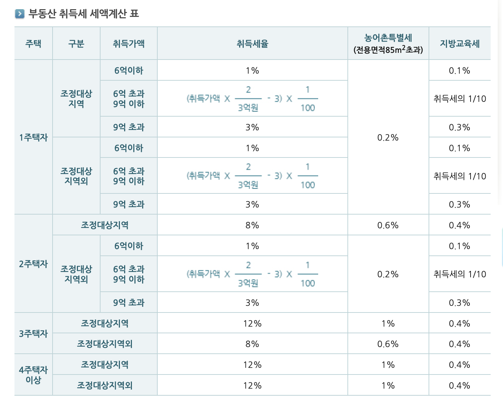

## 1. 취득세

- 취득세란 부동산, 차량, 골프회원권, 콘도미니엄회원권 등의 취득에 대해 해당 부동산 소재지의 도에서 그 취득자에게 부과하는 지방세를 말합니다.
- 상속으로 다음의 재산을 취득하는 경우에는 취득세가 부과됩니다
  - 부동산
  - 차량
  - 기계장비
  - 입목
  - 항공기
  - 선박
  - 광업권
  - 어업권
  - 양식업권
  - 골프회원권
  - 승마회원권
  - 콘도미니엄회원권
  - 종합체육시설이용회원권
  - 요트회원권

## 2. 납부기한

- 취득일자로부터 60일 이내에 신고납부 해야 합니다.
- 60일이 지나기 전이라도 부동산은 등기를 하는 경우 등기 전까지 신고 납부해야 합니다.
- 이 기간이 지날 경우 신고 해태로 무신고가산세와 납부불성실가산세가 추가됩니다. 
- 그래도 납부 안할 경우 체납처분에 대한 내용이 담긴 독촉이 날아오며, 독촉 기간 내에도 납부하지 않으면 재산 압류등 체납처분을 실행합니다.

## 3. 취득세의 산출

```plaintext
취득세액 = 과세표준(취득 당시의 가액) × 세율
```

### 3.1 세액계산 표



**1주택자**

| 구분 | 취득가액 | 취득세율 | 농어촌특별세 (85㎡ 초과) | 지방교육세 |
|------|---------|---------|----------------------|----------|
| 조정대상지역 | 6억 이하 | 1% | 0.2% | 0.1% |
| 조정대상지역 | 6억 초과 ~ 9억 이하 | (취득가액 × 2/3억 - 3) × 1/100 | 0.2% | 취득세의 1/10 |
| 조정대상지역 | 9억 초과 | 3% | 0.2% | 0.3% |
| 조정대상지역외 | 6억 이하 | 1% | 0.2% | 0.1% |
| 조정대상지역외 | 6억 초과 ~ 9억 이하 | (취득가액 × 2/3억 - 3) × 1/100 | 0.2% | 취득세의 1/10 |
| 조정대상지역외 | 9억 초과 | 3% | 0.2% | 0.3% |

**2주택자**

| 구분 | 취득가액 | 취득세율 | 농어촌특별세 (85㎡ 초과) | 지방교육세 |
|------|---------|---------|----------------------|----------|
| 조정대상지역 | - | 8% | 0.6% | 0.4% |
| 조정대상지역외 | 6억 이하 | 1% | 0.2% | 0.1% |
| 조정대상지역외 | 6억 초과 ~ 9억 이하 | (취득가액 × 2/3억 - 3) × 1/100 | 0.2% | 취득세의 1/10 |
| 조정대상지역외 | 9억 초과 | 3% | 0.2% | 0.3% |

**3주택자 이상**

| 주택 | 구분 | 취득세율 | 농어촌특별세 (85㎡ 초과) | 지방교육세 |
|------|------|---------|----------------------|----------|
| 3주택자 | 조정대상지역 | 12% | 1% | 0.4% |
| 3주택자 | 조정대상지역외 | 8% | 0.6% | 0.4% |
| 4주택자 이상 | 조정대상지역 | 12% | 1% | 0.4% |
| 4주택자 이상 | 조정대상지역외 | 12% | 1% | 0.4% |

## 4. 세금감면

### 4.1 생애최초 취득세 감면

- 부동산을 처음 취득할 경우 최대 300만원까지 감면됩니다.
- 12억 이하 주택 대상
- 소득 제한 없음
- 취득 후 3년 내 임대/증여/매매 시 감면 받은 금액을 반환해야 합니다.

## 5. 납부 방법

- 카드 결제 가능
- 분할 납부 가능
  - 여러 카드로 나눠서 납부 가능
- 할부 가능

### 5.1 etax

- 서울시 주택의 경우
- 신용카드 무이자 할부 안내
  - https://etax.seoul.go.kr/CardEvntAction.tran?workcd=notice

### 5.2 wetax

- 서울시 외 주택의 경우